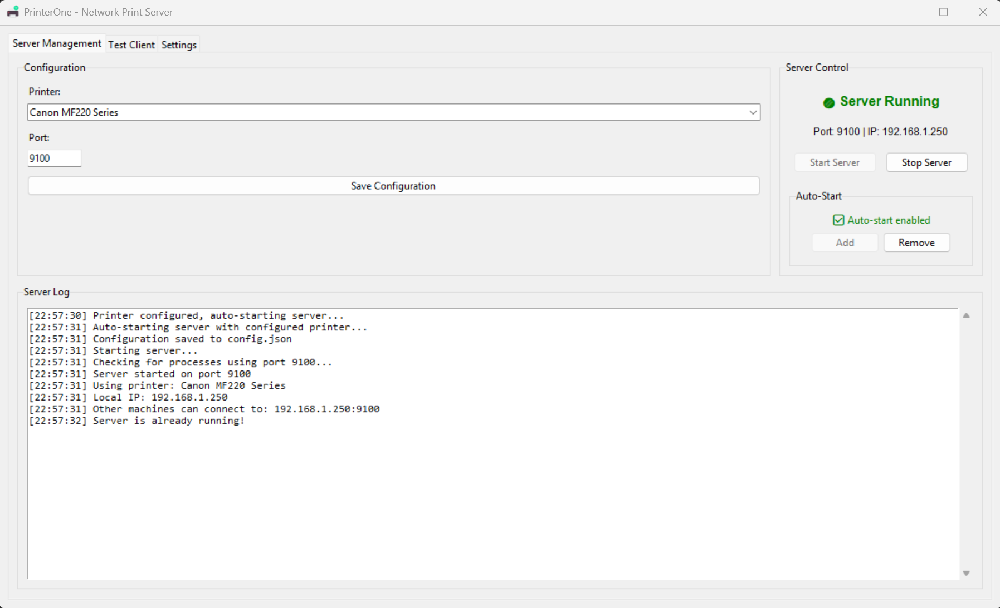

# PrinterOne 🖨️

[](https://github.com/xtieume/PrinterOne/stargazers)
[](https://github.com/xtieume/PrinterOne/network)
[](https://github.com/xtieume/PrinterOne/issues)
[](https://github.com/xtieume/PrinterOne/blob/master/LICENSE)
[](https://github.com/xtieume/PrinterOne/releases)

A comprehensive TCP network print server with integrated GUI management and system tray support for Windows.

> ⚠️ **Quick Fix**: If server starts but clients can't connect, check if port 9100 is blocked by firewall. Consider using [SimpleWall](https://github.com/henrypp/simplewall) for easy firewall management.

**Copyright (c) 2025 xtieume@gmail.com**  
**GitHub: https://github.com/xtieume/PrinterOne**



## ✨ Features

- 🖨️ **TCP Network Print Server** - Receives raw print data over TCP and sends to local printer
- 🖥️ **Modern GUI Interface** - Easy-to-use graphical interface with tabbed layout
- 🔧 **System Tray Integration** - Minimize to tray and control from system tray menu
- 🚀 **Windows Auto-Start** - Add to Windows startup for automatic server launch
- 🧪 **Built-in Test Client** - Test connections and send sample print jobs
- 📊 **Real-time Logging** - Comprehensive logging with emoji indicators for easy reading
- ⚙️ **Configuration Management** - Persistent settings stored in JSON format
- 🔥 **Port Management** - Automatic port conflict resolution
- 🌐 **Network Discovery** - Shows local IP addresses for easy client configuration

## 🎯 Use Cases

- **Network Printing**: Share local printers over TCP network
- **Raw Data Printing**: Print raw data from applications, scripts, or devices
- **Legacy System Integration**: Bridge old systems to modern printers
- **Print Server**: Centralized printing solution for small networks

## 📋 Requirements

- Windows 10/11
- Python 3.9+ (for development)
- Local printer installed

## 🚀 Quick Start

### Option 1: Download Pre-built Executable (Recommended)
1. Download the latest `PrinterOne.exe` from [Releases](https://github.com/xtieume/PrinterOne/releases)
2. Run `PrinterOne.exe gui`
3. Select your printer and configure settings
4. Click "Start Server"
5. ⚠️ **Important**: If clients can't connect, check firewall settings (see [Troubleshooting](#troubleshooting))

### Option 2: Build from Source
```bash
# Clone the repository
git clone https://github.com/xtieume/PrinterOne.git
cd PrinterOne

# Install dependencies
pip install -r requirements.txt

# Build executable
python build.py

# Run the executable
dist/PrinterOne.exe gui
```

### ⚠️ Network Connectivity Requirements

For network printing to work properly:
- **Port 9100** must be accessible on your network
- **Firewall** should allow PrinterOne.exe 
- Some minimal Windows builds may require manual firewall configuration
- Consider using [SimpleWall](https://github.com/henrypp/simplewall) for easy firewall management

## 🖥️ Usage Modes

### GUI Mode (Recommended)
```bash
PrinterOne.exe gui
```
- Full graphical interface
- System tray integration
- Real-time logging
- Built-in test client

### Console Mode
```bash
PrinterOne.exe
```
- Command-line interface
- Suitable for servers or automated deployments

### Test Client Mode
```bash
PrinterOne.exe test
```
- Interactive connection testing
- Send test print jobs

## ⚙️ Configuration

The application uses `config.json` for persistent settings:

```json
{
    "printer_name": "Canon MF220 Series",
    "port": 9100,
    "auto_start": false,
    "service_name": "PrinterOne",
    "service_description": "PrinterOne - Network print server for raw print data",
    "manual": true,
    "minimize_to_tray": true
}
```

### Configuration Options

| Option | Type | Description |
|--------|------|-------------|
| `printer_name` | string | Target printer name (from Windows printer list) |
| `port` | integer | TCP port to listen on (default: 9100) |
| `auto_start` | boolean | Start server automatically |
| `minimize_to_tray` | boolean | Minimize to system tray when closing |

## 🌐 Network Usage

Once the server is running, other machines can send print jobs to:
```
YOUR_IP_ADDRESS:9100
```

Example using netcat:
```bash
echo "Hello World" | nc YOUR_IP_ADDRESS 9100
```

Example using Python:
```python
import socket

def send_to_printer(data, host='192.168.1.100', port=9100):
    with socket.socket(socket.AF_INET, socket.SOCK_STREAM) as s:
        s.connect((host, port))
        s.send(data.encode())

send_to_printer("Test print job")
```

## � Windows Firewall & Network Security

### Firewall Configuration (Important!)

PrinterOne requires **port 9100** to be accessible for network printing. If clients can't connect after starting the server, follow these steps:

#### Method 1: Using SimpleWall (Recommended)
[SimpleWall](https://github.com/henrypp/simplewall) is a lightweight firewall manager that makes configuration easy:

1. **Download SimpleWall**: Visit [https://github.com/henrypp/simplewall](https://github.com/henrypp/simplewall)
2. **Install and run** SimpleWall
3. **Add PrinterOne.exe** to the allowed applications list
4. **Enable network access** for PrinterOne
5. **Allow port 9100** for incoming connections

#### Method 2: Windows Firewall Manual Configuration
```powershell
# Run as Administrator
New-NetFirewallRule -DisplayName "PrinterOne Port 9100" -Direction Inbound -Protocol TCP -LocalPort 9100 -Action Allow
```

#### Method 3: Windows Firewall GUI
1. Open **Windows Defender Firewall** with Advanced Security
2. Click **Inbound Rules** → **New Rule**
3. Select **Port** → **TCP** → **Specific Local Ports**: `9100`
4. **Allow the connection** → Apply to all profiles
5. Name the rule "PrinterOne Port 9100"

### Common Network Issues

- **Minimal Windows builds** (Windows 10/11 LTSC, custom builds) may have restrictive default firewall settings
- **Corporate networks** may block port 9100 by policy
- **Antivirus software** may interfere with network connections
- **Virtual machines** may require additional network configuration

## �🔧 Advanced Features

### System Tray Integration
- Right-click tray icon for quick actions
- Start/stop server from tray menu
- Show/hide main window
- Minimize to tray on close

### Auto-Start Configuration
- Add to Windows startup registry
- Auto-start with configured printer
- Background operation support

### Logging System
- Real-time logging with emoji indicators
- Automatic log rotation (30-day retention)
- Separate test client logging
- File-based logging for debugging

## 🛠️ Development

### Project Structure
```
PrinterOne/
├── server.py          # Main application
├── build.py           # Build script
├── requirements.txt   # Python dependencies
├── config.json        # Configuration file
├── PrinterOne.spec    # PyInstaller spec
├── assets/           # Assets folder
│   └── screenshot.png # Application screenshot
├── dist/             # Built executables
└── logs/             # Application logs
```

### Building
```bash
# Install development dependencies
pip install -r requirements.txt

# Build executable
python build.py

# Clean build
python build.py --clean
```

### Dependencies
- `pywin32` - Windows API integration
- `pystray` - System tray support
- `Pillow` - Image processing
- `psutil` - Process management
- `pyinstaller` - Executable packaging

## 🐛 Troubleshooting

### Common Issues

**Q: Server starts but clients can't connect to port 9100**  
A: ⚠️ **IMPORTANT**: Check if port 9100 is publicly accessible. Some minimal Windows builds may have restrictive firewall settings that block the port.

**Solution**: Install a firewall manager like [SimpleWall](https://github.com/henrypp/simplewall) to properly allow port 9100:
1. Download and install [SimpleWall](https://github.com/henrypp/simplewall)
2. Add PrinterOne.exe to allowed applications
3. Ensure port 9100 is open for incoming connections
4. Alternative: Use Windows Firewall to create an inbound rule for port 9100

**Q: Tray icon not visible**  
A: Check Windows notification area settings to show PrinterOne icon.

**Q: Port already in use**  
A: The server automatically kills conflicting processes. Check if another service is using port 9100.

**Q: Printer not found**  
A: Ensure the printer is installed and accessible from Windows. Use exact printer name from Windows printer list.

### Firewall Configuration

For proper network printing, ensure:
- **Inbound**: Port 9100 TCP is open
- **Application**: PrinterOne.exe is allowed through firewall
- **Network**: Windows network discovery is enabled (optional)

### Debug Mode
Enable verbose logging by running:
```bash
PrinterOne.exe gui --debug
```

## 📝 License

This project is licensed under the MIT License - see the [LICENSE](LICENSE) file for details.

## 🤝 Contributing

Contributions are welcome! Please feel free to submit a Pull Request.

1. Fork the project
2. Create your feature branch (`git checkout -b feature/AmazingFeature`)
3. Commit your changes (`git commit -m 'Add some AmazingFeature'`)
4. Push to the branch (`git push origin feature/AmazingFeature`)
5. Open a Pull Request

## 📞 Support

- 🐛 **Bug Reports**: [GitHub Issues](https://github.com/xtieume/PrinterOne/issues)
- 💡 **Feature Requests**: [GitHub Issues](https://github.com/xtieume/PrinterOne/issues)
- 📧 **Email**: xtieume@gmail.com

## ⭐ Show Your Support

If this project helped you, please consider giving it a ⭐ on GitHub!

---

<div align="center">
Made with ❤️ by <a href="mailto:xtieume@gmail.com">xtieume</a>
</div>